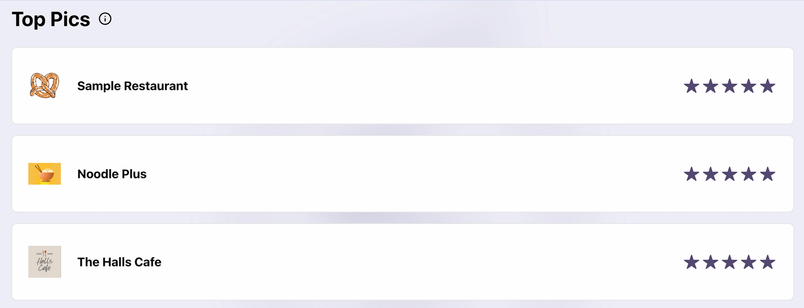
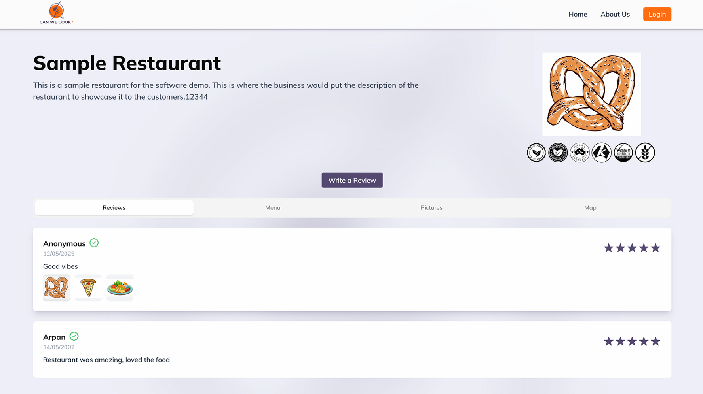
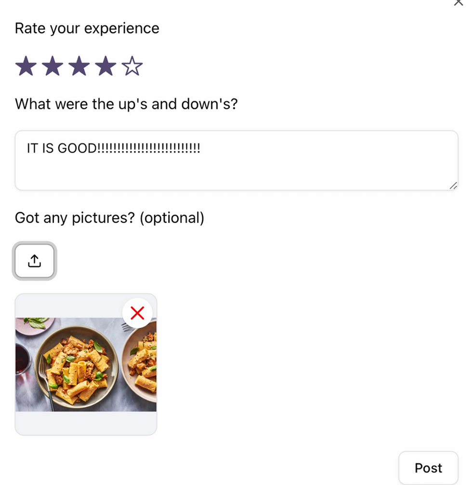
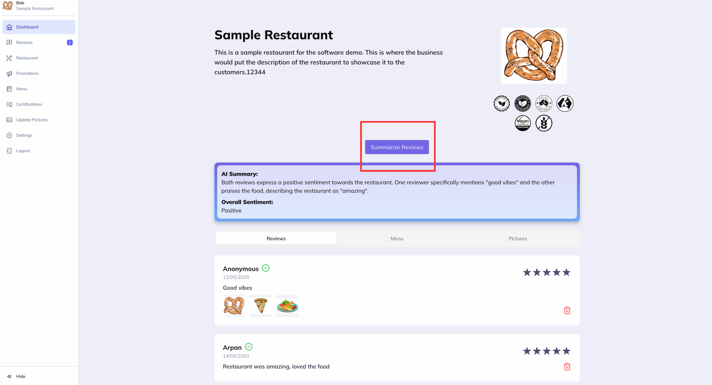
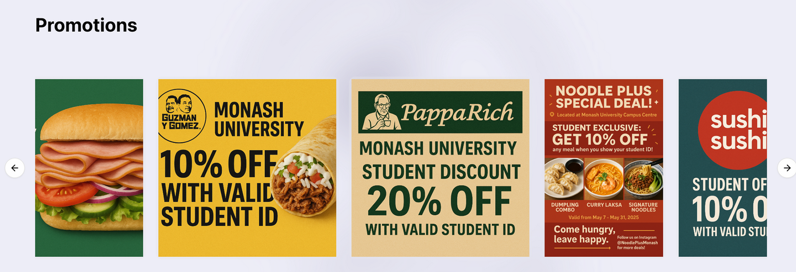
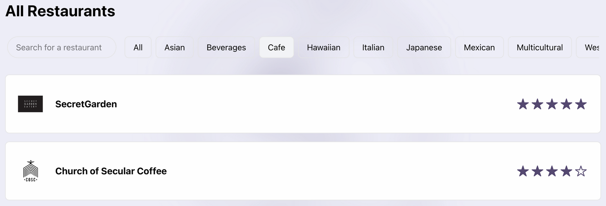

# 🍽️ Can We Cook? — Yes We Can!

> An Electronic Restaurant Review Platform for Monash University

   

---

## 📖 Overview

**Can We Cook?** is an online restaurant reviewing platform built for the Monash University campus community. It connects students, staff, and local businesses — making it easy to discover food, read and post reviews, browse menus and photos, and rate restaurants.

By aggregating community feedback, the platform helps businesses understand their customers and continuously improve their services.

---

## ✨ Features

### For Customers
- 🔍 **Discover** restaurants on campus with search and category filters (Asian, Café, Italian, Japanese, Mexican, and more)
- ⭐ **Read & post reviews** with star ratings and multimedia attachments
- 📋 **Browse menus and photos** for each restaurant
- 🗺️ **Campus map integration** to locate restaurants easily
- 🏆 **Top 3 weekly recommendations** powered by a review-based algorithm
- 🎟️ **Promotions banner** showcasing student-exclusive deals

### For Business Owners
- 📊 **Owner dashboard** to manage restaurant profile, menu, pictures, certifications, and promotions
- 💬 **View customer reviews** and respond to feedback
- 🤖 **AI-powered review summarisation** (via Gemini API) for quick sentiment insights
- 📢 **Advertise promotions** directly to the campus community

---

## 🖥️ Screenshots

| Feature | Description |
|---|---|
|  | Weekly top 3 restaurants ranked by average review score |
| | Full profile with reviews, menu, pictures, and map |
|  | Star rating, written feedback, and optional photo upload |
|  | Manage all aspects of a restaurant listing with AI summaries |
|  | Scrollable banner of active student discounts |
|  | Search and filter by cuisine category |

---

## 🛠️ Tech Stack

### Core
| Layer | Technology |
|---|---|
| Frontend | React + TypeScript |
| Storage | Firebase (user data & reviews) |
| Image Hosting | ImageBB |
| Version Control | GitLab |

### Libraries & APIs
| Purpose | Tool |
|---|---|
| AI Summarisation | Google Gemini API |
| Campus Maps | MazeMaps |
| Animations | Framer Motion |
| Email Notifications | EmailJS |
| Session Management | react-cookie |
| Authentication | Firebase Auth |
| Scheduled Jobs | Croner |
| Data Fetching | React Query |
| UI Components | shadcn/ui |

### Development & Testing Tools
| Tool | Use |
|---|---|
| Figma | UI/UX design and prototyping |
| Lucidchart | Architecture diagrams |
| Locust | Load and performance testing |
| Google Cloud Console | Cloud service management |

---

## 🏗️ Architecture

```
┌─────────────────────────────────────┐
│           Frontend (React TS)       │
│  ┌──────────────┐  ┌──────────────┐ │
│  │ AI Summary   │  │ Campus Map   │ │
│  │ (Gemini)     │  │ (MazeMap)    │ │
│  └──────────────┘  └──────────────┘ │
└────────────┬────────────────────────┘
             │ Communication
    ┌────────┴───────────┐
    │      Firebase      │
    │  ┌──────────────┐  │
    │  │ User Info    │  │
    │  └──────────────┘  │
    │  ┌──────────────┐  │
    │  │   Reviews    │  │
    │  └──────────────┘  │
    └────────────────────┘
             │
    ┌────────┴─────────┐
    │     ImageBB      │
    │ (Picture Storage)│
    └──────────────────┘
```

---

## 🚀 Getting Started

### Prerequisites
- Node.js (v18+)
- A Firebase project with Firestore and Authentication enabled
- API keys for: Gemini, ImageBB, EmailJS, MazeMaps

### Installation

```bash
# Clone the repository
git clone <your-gitlab-repo-url>
cd can-we-cook

# Install dependencies
npm install
```

### Configuration

Create a `.env` file in the root directory and populate it with your API keys:

```env
VITE_FIREBASE_API_KEY=your_firebase_api_key
VITE_FIREBASE_AUTH_DOMAIN=your_auth_domain
VITE_FIREBASE_PROJECT_ID=your_project_id
VITE_FIREBASE_STORAGE_BUCKET=your_storage_bucket
VITE_FIREBASE_MESSAGING_SENDER_ID=your_sender_id
VITE_FIREBASE_APP_ID=your_app_id
VITE_GEMINI_API_KEY=your_gemini_api_key
VITE_IMAGEBB_API_KEY=your_imagebb_api_key
VITE_EMAILJS_SERVICE_ID=your_emailjs_service_id
VITE_EMAILJS_TEMPLATE_ID=your_emailjs_template_id
VITE_EMAILJS_PUBLIC_KEY=your_emailjs_public_key
```

> ⚠️ Never commit your `.env` file. It is listed in `.gitignore` by default.

### Running the App

```bash
npm run dev
```

The app will be available at `http://localhost:5173`.

---

## 📦 Deployment

Refer to the included `DEPLOYMENT.md` for full instructions on deploying to your hosting environment, including Firebase Hosting setup and build configuration.

```bash
npm run build
```

---

## 🧪 Testing

Load and performance testing was conducted using **Locust**. Test reports are included in the `/test-reports` directory.

---

## 🔮 Future Improvements

- **Scalability** — Optimise image storage performance for higher traffic loads
- **Security** — Strengthen authentication flows and introduce regular security audits
- **User Incentives** — Points/rewards system to encourage more review submissions
- **Profanity Filter** — Automatically detect inappropriate content in reviews and images
- **Review Deletion** — Revamped mechanism for removing reviews
- **Paid Tier Upgrade** — Move off free-tier service limits for faster API responses
- **Owner Replies** — Allow restaurant owners to respond directly to customer reviews

---

## 👥 Team — S2_CS_13

| Name | Student ID |
|---|---|
| Michael Arnold Sutriady | 33311145 |
| Arpan George Mathew | 31534562 |
| Shlok Arjun Marathe | 32841906 |
| Heah Wei Sen | 33476322 |

---

## 📋 Project Management

This project was managed using an **Agile methodology** with Scrum ceremonies and a Kanban board, enabling continuous feedback, iterative development, and clear progress visibility throughout the project lifecycle.

---

*Built with ❤️ at Monash University*
